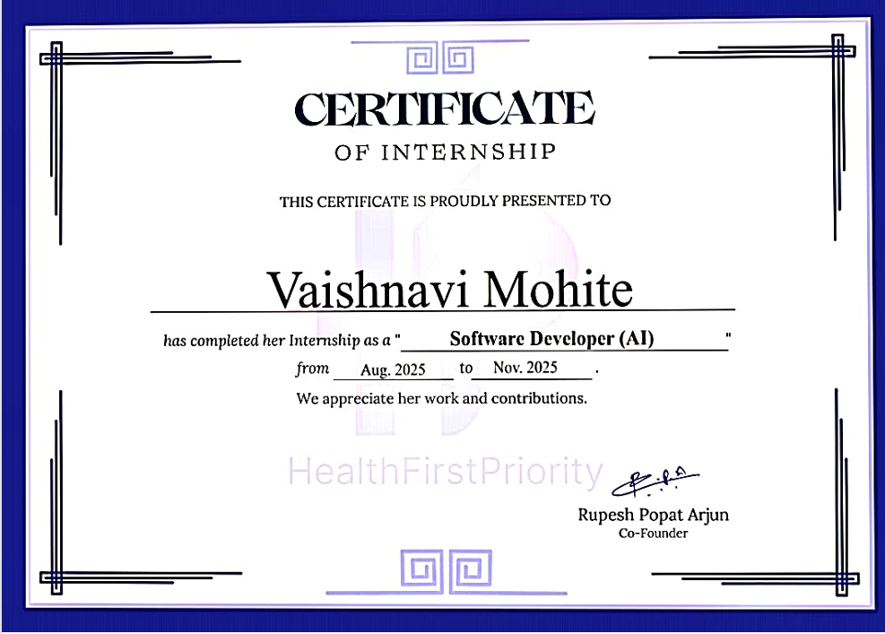

# Internship Documentation
### Medical AI Chatbot — LLM Evaluation & Infrastructure Research

**Company:** HealthFirstPriority  
**Role:** Software Developer (AI)  
**Duration:** August 2025 – November 2025  

---

## Overview

This repository documents the research and evaluation work carried out during my internship at HealthFirstPriority, a health-tech startup. The project involved building a medical AI chatbot capable of handling patient-doctor style conversations using open-source LLMs.

My primary contribution was the **model selection and infrastructure research phase** — evaluating multiple large language models, studying deployment architectures, and exploring optimization techniques to identify the best technical stack for a medical-use AI assistant that could run on consumer-grade hardware without exposing patient data to central servers.

**Key areas of work:**
- LLM benchmarking and selection across 5 model families
- P2P deployment architecture research for privacy-preserving inference
- Model optimization via quantization (PTQ & QAT)
- Model sharding research for low-resource deployment

---

## Internship Certificate

---

## 1. Evaluation Dataset

All benchmarking experiments were conducted on a consistent medical QA dataset provided by the project guide. The same dataset was used across all team experiments, ensuring fair and comparable results.

| Property | Detail |
|----------|--------|
| Format | Conversational QA — patient question + doctor response |
| Type | Medical dialogue dataset |
| Language | English |
| Usage | Consistent across all team experiments for fair comparison |

The dataset was selected because it mirrors the real use case — conversational medical dialogue — rather than multiple-choice benchmarks, which would not accurately reflect chatbot response quality.

---

## 2. LLM Model Evaluation

The core research task was evaluating multiple open-source LLMs to identify the best fit for a medical chatbot. Key selection criteria were accuracy on medical QA, response latency, hardware requirements, and commercial licensing.

### 2.1 Models Evaluated

| Model | Developer | Parameters | Type | VRAM (4-bit) | License |
|-------|-----------|------------|------|--------------|---------|
| **Qwen 2.5 7B Instruct** | Alibaba Cloud | 7B | Instruct | 8–12 GB | Apache 2.0 |
| Qwen 2.5 7B Base | Alibaba Cloud | 7B | Base | 8–12 GB | Apache 2.0 |
| Phi-3.5 Mini Instruct | Microsoft | 3.8B | Instruct | 3–4 GB | MIT |
| Mistral 7B Instruct v0.1 | Mistral AI | 7B | Instruct | 5–8 GB | Apache 2.0 |
| Mistral 7B Instruct v0.2 | Mistral AI | 7B | Instruct | 5–8 GB | Apache 2.0 |
| Mistral 7B Base v0.1 | Mistral AI | 7B | Base | 5–8 GB | Apache 2.0 |
| BioMistral 7B | Open Source | 7B | Medical FT | 8–12 GB | Apache 2.0 |
| LLaMA 3 8B | Meta AI | 8B | Base/Instruct | 6–10 GB | Meta License |

### 2.2 Benchmark Results

| Model Variant | Accuracy | Avg Latency | Notes |
|---------------|----------|-------------|-------|
| **Qwen 2.5 7B Instruct (best run)** | **71.24%** | 9.28ms mean | Highest accuracy overall |
| Qwen 2.5 7B Instruct | 64.71% | 0.441 sec/q | Consistent across runs |
| Qwen 2.5 7B Base (best) | 62.75% | — | Base model, no instruction tuning |
| Phi-3.5 Mini Instruct (best) | 64.02% | 0.19 sec | Fastest latency of all models |
| Mistral 7B Instruct v0.2 | 48.37% | 0.246 sec | Best Mistral variant |
| Mistral 7B Instruct v0.1 | 47.71% | — | Slightly below v0.2 |
| Mistral 7B Base v0.1 | 18–21% | — | Base model, not instruction tuned |

### 2.3 Model Selection — Qwen 2.5 7B Instruct

**Qwen 2.5 7B Instruct** was selected as the final model based on:

- **Highest accuracy (71.24%)** on the medical QA dataset — significantly above all Mistral variants
- **Apache 2.0 license** — fully safe for commercial medical deployment
- **Strong instruction following** — critical for consistent, structured medical responses
- **Good latency** — competitive response speed at the 7B parameter scale
- **Wide tooling support** — works with Ollama, HuggingFace Transformers, and quantization frameworks

**Key tradeoffs observed:**

- BioMistral was domain-pretrained on medical literature (PubMed) but did not outperform Qwen on conversational QA — domain pretraining helps on clinical benchmarks but not necessarily on dialogue tasks
- Phi-3.5 Mini had excellent latency (0.19s) at 64% accuracy — best fallback if hardware is under 4GB VRAM
- Base models scored dramatically lower than instruct variants — instruction fine-tuning is essential for QA tasks
- Mistral variants underperformed despite being strong general-purpose models — instruction tuning quality matters more than architecture for this use case

---

## 3. P2P Architecture Research

A key concern for a medical chatbot is **data privacy** — patient queries should not pass through centralized servers that could expose sensitive health information. This motivated research into peer-to-peer (P2P) deployment architectures.

### 3.1 Pure P2P (Unstructured)

No central server. All peers act as both client and server. Resource discovery happens via **flooding** — a query is broadcast to all neighbors with a TTL (Time To Live) value that decrements at each hop.

**How flooding works:**
1. Peer A sends a query to all its neighbors
2. Each neighbor checks if it has the data — if not, forwards the query (TTL - 1)
3. When TTL reaches 0, forwarding stops
4. The peer that has the data responds back along the reverse path

**Example:** Gnutella protocol

**Limitation for medical use:** Flooding wastes bandwidth; no guarantee of finding data before TTL expires; unreliable at scale. Not suitable as a standalone production solution.

---

### 3.2 Hybrid P2P — Napster Model

Combines a **centralized index server** with **decentralized data transfer** between peers.

**How Napster worked:**
1. Central server maintained an index: `filename → list of peers who have the file`
2. User search queries went to the central server
3. Server returned a list of peers — actual data transfer happened peer-to-peer
4. Server was only involved in indexing and discovery, not data transfer

**Relevance to medical chatbot:** A hybrid model could allow a lightweight central index to coordinate query routing, while actual inference happens on peer devices — reducing cloud costs and privacy risks.

**Drawback:** Central index server remains a single point of failure.

---

### 3.3 Structured P2P — Distributed Hash Table (DHT)

Peers organized in a predefined structure. Resources mapped using a **Distributed Hash Table** — no central server needed.

**How DHT works:**
1. Each peer holds a small segment of a shared hash table
2. Hash table maps resource identifiers → peer locations
3. Peer looking for data looks up the hash in the DHT
4. DHT returns peers that have it — no central server required

**Examples:** Modern BitTorrent (with DHT), Kademlia, Chord

**Advantage for medical use:** No single point of failure — network continues functioning even if some peers go offline. Better privacy and resilience.

**Tradeoff:** More complex to implement; peer discovery slightly slower than a centralized index.

---

## 4. Model Sharding & Low-Resource Deployment

Large language models at 7B parameters require significant GPU memory — often more than available on a consumer laptop. **Model sharding** was researched to make these models deployable without expensive hardware.

### 4.1 What is Model Sharding?

Dividing a large model into smaller components (shards) distributed across devices or executed sequentially on a single device using CPU offloading.

- Each shard contains a subset of model layers (e.g., layers 1–16 in Shard 1, layers 17–32 in Shard 2)
- Shards are processed sequentially — output of Shard 1 becomes input of Shard 2
- Results combined to produce the final output

### 4.2 CPU Offloading Strategy

For single-GPU deployment where the full model exceeds GPU memory:

| Step | Location | Action |
|------|----------|--------|
| 1 | CPU RAM | Both shards stored in CPU RAM (combined size exceeds GPU memory) |
| 2 | GPU | Load Shard 1 → process input through Shard 1 layers → store intermediate results |
| 3 | CPU RAM | Unload Shard 1 back to CPU RAM → free GPU memory |
| 4 | GPU | Load Shard 2 → process Shard 1 output through Shard 2 layers |
| 5 | Output | Final output generated. PCIe transfer is the key latency bottleneck. |

**Example:** A 20GB model can run on a 16GB GPU by splitting into a 12GB shard and an 8GB shard, swapping between CPU and GPU as needed.

### 4.3 Benefits

- Enables models too large for a single GPU to run locally
- Reduces hardware requirements — makes 7B models accessible on consumer laptops
- Supports privacy-preserving deployment — model runs on-device, no data sent to cloud
- Enables distributed inference across multiple machines in a P2P network

---

## 5. Model Quantization

Even after model selection, 7B models in full precision (FP32) require 28GB+ of memory. **Quantization** reduces numerical precision of model weights, significantly cutting memory usage with minimal accuracy loss.

### 5.1 Post-Training Quantization (PTQ)

Applied **after** training is complete — no retraining required.

- Converts weights from FP32 → INT8 or INT4
- Reduces model size by 2–8x depending on precision
- Minimal accuracy loss for most tasks
- Practical tools: `bitsandbytes`, `GPTQ`, `AWQ`, `GGUF` (used in Ollama)

> **This was the primary optimization used during the internship** — works directly on downloaded model checkpoints, no training infrastructure needed.

### 5.2 Quantization-Aware Training (QAT)

Quantization **simulated during training** so the model learns to compensate for precision loss.

- Higher accuracy than PTQ, especially for sensitive tasks like medical QA
- Requires full training infrastructure — not practical for on-the-fly deployment
- Better choice when retraining resources are available

### 5.3 Memory Savings

| Model | FP32 Size | INT8 Size | INT4 Size | Practical GPU |
|-------|-----------|-----------|-----------|---------------|
| Qwen 2.5 7B | ~28 GB | ~14 GB | ~6–8 GB | RTX 3060 / 4060 |
| Mistral 7B | ~28 GB | ~14 GB | ~5–7 GB | RTX 3060 / 4060 |
| Phi-3.5 Mini 3.8B | ~15 GB | ~7.5 GB | ~3–4 GB | GTX 1650 / 3050 |
| BioMistral 7B | ~28 GB | ~14 GB | ~6–8 GB | RTX 3060 / 4060 |

---

## 6. Key Findings & Recommended Stack

### Final Recommended Stack

| Component | Decision |
|-----------|----------|
| **LLM Model** | Qwen 2.5 7B Instruct — highest accuracy, Apache 2.0, strong instruction following |
| **Quantization** | PTQ INT4 (GGUF/AWQ) — reduces to 6–8GB VRAM, no retraining needed |
| **Deployment Architecture** | Hybrid P2P — central index for coordination, peer-to-peer for privacy |
| **Dataset** | Medical conversational QA dataset (patient-doctor pairs) — provided by guide |
| **Fallback Model** | Phi-3.5 Mini 3.8B (MIT) — if hardware constrained under 4GB VRAM |

### Key Learnings

- **Instruction tuning is critical** — base models scored 22–31% vs 64–71% for instruct variants of the same model
- **Domain pretraining ≠ better dialogue** — BioMistral (medically fine-tuned) did not outperform general Qwen on conversational QA
- **PTQ INT4 is highly practical** — 4–8x memory reduction with minimal accuracy impact
- **Hybrid P2P is most production-ready** — pure P2P flooding is too inefficient for real use
- **Model sharding enables local deployment** — makes 7B models feasible on single consumer GPUs
- **Licensing is a real engineering constraint** — model selection must account for commercial rights, not just benchmark scores

---

*This documentation represents genuine research and evaluation work conducted during the internship at HealthFirstPriority. All benchmark results are from actual team experiments conducted across multiple researchers on a shared evaluation dataset.*
